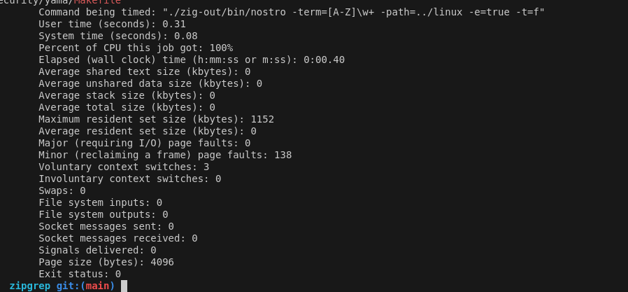

<div align="center"> 


# nostro
Nostro recursively searches directories for a user provided inputs.

# Contents
[Inputs](#inputs) |
[Usage](#usage) |
[Examples](#examples) |
[Benchmarks](#benchmarks) |
[Corpus](#corpus) |
[Limitations](#limitations) |
[Honorable Mentions](#honorable-mentions) |

</div>

## Inputs
All flags are optional, if no flags (other than the mandatory `term` flag) are passed, then nostro hunt for any exact matches (strings containing the given term). Otherwise, the flags will be incorporated into the search to refine the findings.

Note: *all* flags are treated as *or* statements when entered. If you enter `-e` and `-p` nostro assumes you desire *either* of the given elements to be present, so it will match if the prefix or regex match.

Nostro uses the following flags to denote search string:

Mandatory flags:
```bash
-term="word to search"
```

Optional flags to refine search:

```bash
-path="path" // If path is not set, nostro will start from the root of your OS. THis can take a while, so generally its recommended to set a directory.

-t="f or d" // Denotes if you are searching for a file or a directory. Default is to search for files unless specified otherwise

-e=Optional (optional: true)

-i=Optional (optional: true)
```

## Usage

### Regular expression
Utilizing the `-e=true` flag will expect a regular expression in the term field for matching/parsing of files/directories.

Example:
from the benchmarking code, you can ascertain the following example:
```bash
./zig-out/bin/nostro -term='[A-Z]\w+' -path="../linux" -e=true -t=f
```

Utilizing `-i` will lowercase cast the input strings to avoid any case sensitive matching.

`-t` denotes the file type. You can use: `t=d` for directory searches or just leave the default in place which searches files.

### Paths
You can use either relative paths `../` or absolute paths `/home/user/Documents` for the `-path` argument.

### Outputs
The output is similiar to egrep. The values, if found, are printed on individual lines to be viewed by the user

## Examples
Examples:
```bash
./zig-out/bin/nostro -term="firm" -path="../linux" -i=true -t=f
./zig-out/bin/nostro -term="licenses" -path="../linux" -i=true -t=d
./zig-out/bin/nostro -term="(fi)" -path="../linux" -e=true 
```

## Benchmarks
Note: I did not make this application in any attempt to beat any existing tools out there (since plenty do this *exact* thing), but just a quick item to curate over an hour or two to try out different Zig regex engines. I did toss benchmarks in here simply for fun and to satiate my inner data nerd. 

I did not parake in establishing a fancy benchmarking enviornment, I utilized the following command to run the code with FIFO priority 99 on an Ubuntu liunux system to ensure CPU context switching would not interfere with the code execution:

```bash
sudo chrt -f 99 /usr/bin/time --verbose <benchmark>
```

```bash
sudo chrt -f 99 /usr/bin/time --verbose ./zig-out/bin/nostro -term='[A-Z]\w+' -path="../linux" -e=true -t=f
```

Results:


## Corpus
The linux kernel code was utilized for these expiriments: https://github.com/BurntSushi/linux
It is a rather robust download, but offered a decently sized allotment of data to attempt to parse.

## Limitations
Nostro (currently) does not read files for the given input strings, Nostro simply parses the files on disk to ascertain file names, not contents. 
If you wish to parse the contents of files, use [Ripgrep](https://github.com/BurntSushi/ripgrep) or a similiar application.


## Honorable Mentions
Initially, I thought I would re-create the wheel and make a regex parsing libary (naturally this seemed like the best idea :3 ). 

After some rigerous internal debate, I decided to attempt to utilize the existing Zig packages out there to see what would would best for my needs before embarking on that journey. After trying a few I landed on [mvzr](https://github.com/mnemnion/mvzr)
Go checkout the repo and such if you like the work :) It works well and its pretty quick and efficient

[Top](#contents)